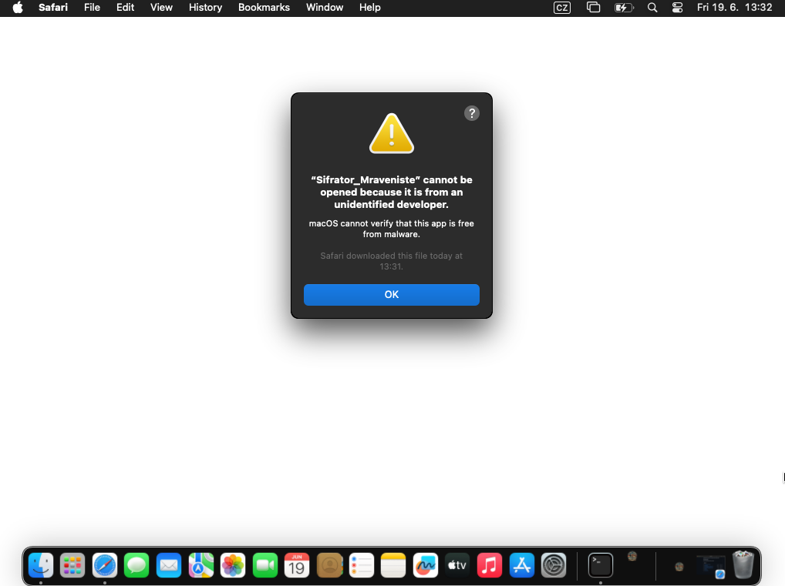
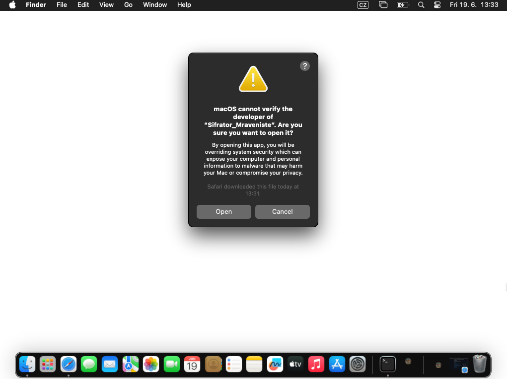

# Šifrátor Mraveniště – první spuštění

Tento návod slouží pro první spuštění aplikace **Sifrator_Mraveniste v0.0.4** na Windows a macOS.

---

## 1. Stažení správné verze

Na GitHub Releases stáhni správný ZIP podle systému:

| Systém | Soubor |
|---|---|
| Windows 10/11 64-bit | `Sifrator_Mraveniste_windows-x64_v0.0.4.zip` |
| Mac s Apple Silicon / Apple A18 Pro / M1 / M2 / M3 / M4 | `Sifrator_Mraveniste_macos-arm64_v0.0.4.zip` |
| Mac s procesorem Intel | `Sifrator_Mraveniste_macos-x64_v0.0.4.zip` |

Na Macu zjistíš typ procesoru v Terminálu příkazem:

```bash
uname -m
```

Výsledek:

```text
arm64  = stáhni macos-arm64
x86_64 = stáhni macos-x64
```

## Co najdeš ve v0.0.4

Po spuštění se otevře **Velitelská paluba**, ze které vstoupíš do šifrátoru, plánovače, hromadného šifrování, přehledu šifer, historie zpráv, oddílů, sportovního dne a tiskového studia diplomů.

V dlaždici **Oddíly** klikni na **IMPORTOVAT EXCEL** a vyber stejně strukturovaný `.xls` nebo `.xlsx`. Každý list se načte jako jeden oddíl; počty oddílů, dětí i vedoucích mohou být libovolné. Podpora starého `.xls` je přibalená přímo v aplikaci. Při opakovaném importu se provedou jen změny, stejné osoby se nezdvojí a ručně přidané údaje zůstanou zachované. Kliknutím na osobu otevřeš její kartu, kde lze změnit všechny údaje nebo přidat vlastní položku, například telefon. Oddíly lze exportovat společně i jednotlivě a jejich jména se nabízejí při přidávání soutěžícího ve Sportovním dni.

Sportovní den ukládá posádku, výzvy a výsledky automaticky. V sekci **Diplom** najdeš diplom za tábor, diplom za sportovní den, diplom za úklid, hodnocení úklidu chatek, denní program a jídelníček. Všechny tyto tiskoviny lze před tiskem upravit v živém náhledu, uložit do PDF a vytisknout s pirátským pozadím nebo v šetrné variantě.

V editoru libovolné tiskoviny klikni na text přímo v náhledu. Tažením ho přesuneš a úchytem v pravém dolním rohu změníš velikost pole. V levém panelu lze upravit obsah, styl a velikost písma, tučnost, kurzívu, podtržení, zarovnání i natočení nebo přidat další textové pole. Stejné ovládání funguje také u nadpisů, dat a názvů chatek v hodnocení úklidu. Pomocný tyrkysový rámeček se netiskne.

Pokročilé volby umožňují nastavit barvu písma, přeškrtnutí, svislé zarovnání, velká či malá písmena, mezery a šířku znaků, průhlednost, jemný stín a pořadí překrývajících se textů. Volba **AUTOMATICKÁ** vrátí kontrastní barvu odpovídající pozadí. Textová pole nemají žádné tisknutelné pozadí.

Tlačítko **POUŽÍT PIRÁTSKÉ PÍSMO — PIRATA ONE** nastaví na vybraný text přibalený pirátský font. Funguje i s českou diakritikou a není nutné jej instalovat do systému.

---

# Windows – první spuštění

1. Stáhni ZIP pro Windows.
2. ZIP rozbal například na plochu.
3. Otevři rozbalenou složku.
4. Spusť soubor:

```text
Sifrator_Mraveniste.exe
```

Pokud Windows zobrazí varování SmartScreen, zvol:

```text
Další informace → Přesto spustit
```

---

# macOS – první spuštění

macOS může aplikaci zablokovat, protože aplikace zatím není podepsaná placeným Apple Developer certifikátem. To je očekávané chování.

## Doporučený postup

1. Stáhni správný ZIP pro svůj Mac.
2. ZIP rozbal.
3. Přesuň aplikaci:

```text
Sifrator_Mraveniste.app
```

do složky:

```text
Applications / Aplikace
```

Doporučené umístění:

```text
/Applications/Sifrator_Mraveniste.app
```

---

## Varianta A – otevření přes Finder

1. Otevři složku **Applications / Aplikace**.
2. Najdi **Sifrator_Mraveniste.app**.
3. Klikni na aplikaci pravým tlačítkem.
4. Zvol **Open / Otevřít**.
5. Pokud se zobrazí potvrzovací okno, klikni na **Open / Otevřít**.

---

## Varianta B – přes Privacy & Security

Při prvním spuštění se může zobrazit toto okno:



Klikni na **OK**.

Potom otevři:

```text
System Settings → Privacy & Security
```

Dole v části **Security** se zobrazí informace, že aplikace byla zablokována.

Klikni na:

```text
Open Anyway
```


Potom se zobrazí potvrzovací okno. Klikni na:

```text
Open
```



Od této chvíle by se aplikace měla spouštět normálně.

---

## Varianta C – Terminal, když macOS píše, že aplikace je poškozená

Pokud macOS napíše něco jako:

```text
aplikace je poškozená a nelze ji otevřít
```

nebo:

```text
cannot be opened because Apple cannot check it for malicious software
```

spusť v Terminálu:

```bash
xattr -dr com.apple.quarantine "/Applications/Sifrator_Mraveniste.app"
chmod -R u+x "/Applications/Sifrator_Mraveniste.app/Contents/MacOS"
open "/Applications/Sifrator_Mraveniste.app"
```

Pokud aplikace zůstala ve stažených souborech, použij místo toho:

```bash
cd ~/Downloads
xattr -dr com.apple.quarantine "Sifrator_Mraveniste.app"
chmod -R u+x "Sifrator_Mraveniste.app/Contents/MacOS"
open "Sifrator_Mraveniste.app"
```

Lepší je ale aplikaci přesunout do **Applications / Aplikace**.

---

# Aktualizace aplikace

Aplikace při startu kontroluje novou verzi podle souboru `update.json` na GitHubu.

Pokud je dostupná nová verze, zobrazí se okno s nabídkou aktualizace. Aktualizace zachová plán tábora, historii, poznámky, importované oddíly i uložená data sportovního dne.

Na macOS doporučuji mít aplikaci ve složce:

```text
/Applications/Sifrator_Mraveniste.app
```

Když se aplikace spouští přímo ze stažené složky nebo z dočasné cesty, macOS může použít App Translocation a automatická aktualizace nemusí přepsat skutečnou aplikaci.

---

# Logování a diagnostika

V aplikaci je dole ve stavovém řádku položka:

```text
LOGOVÁNÍ: Vypnuto
```

Kliknutím se otevře okno s live logy a stav se změní na:

```text
LOGOVÁNÍ: Zapnuto
```

Po zavření okna se logování vypne.

Diagnostické logy aktualizací jsou zde:

## Windows

```text
%TEMP%\sifrator_update_debug.log
```

## macOS

```text
/tmp/sifrator_update_debug.log
/tmp/sifrator_update_install.log
```

Na Macu je zobrazíš příkazy:

```bash
cat /tmp/sifrator_update_debug.log
cat /tmp/sifrator_update_install.log
```

---

# Když aplikace nejde spustit

Zkontroluj:

1. Máš správný balíček pro svůj systém.
2. Na Macu používáš `macos-arm64` pro Apple Silicon / A18 Pro / M1 / M2 / M3 / M4.
3. Aplikace je rozbalená ze ZIPu.
4. Na Macu je ideálně přesunutá do složky `/Applications`.
5. Na Macu jsi povolil spuštění v **Privacy & Security**.
6. Pokud je potřeba, odstranil jsi quarantine atribut přes `xattr`.
7. V titulku aplikace je uvedena očekávaná verze `v0.0.4`.

---

# Rychlé příkazy pro macOS

```bash
uname -m
xattr -dr com.apple.quarantine "/Applications/Sifrator_Mraveniste.app"
chmod -R u+x "/Applications/Sifrator_Mraveniste.app/Contents/MacOS"
open "/Applications/Sifrator_Mraveniste.app"
```
